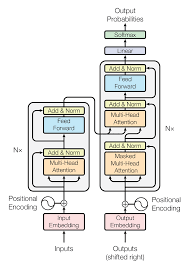
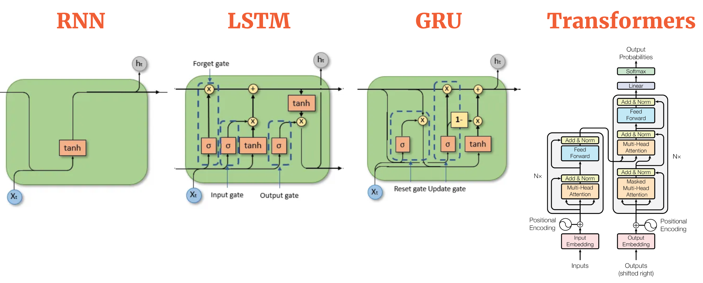

# LLMs-FineTune-TurkishSource

## Large Language Model(Büyük Dil Modeli) Nedir?

Büyük Dil Modelleri (LLM - Large Language Models), büyük miktarda metin verisi üzerinde eğitilmiş ve genellikle milyarlarca parametreye sahip olan yapay zeka modelleridir. Bu modeller, dil anlama ve üretme görevlerinde son derece başarılıdır ve çeşitli doğal dil işleme (NLP) görevlerinde kullanılır.

Örneğin, GPT-3, BERT ve T5 gibi modeller, metinleri anlamada ve yeni metinler üretmede oldukça etkilidir. GPT-3, özellikle metin üretme konusunda harikalar yaratır; bir hikaye yazmak, bir makale oluşturmak veya bir müşteri hizmetleri botu oluşturmak için kullanılabilir. Diyelim ki bir yazılım geliştirme forumunda bir soru sordunuz; GPT-3, bu soruya anlamlı ve detaylı bir yanıt verebilir.

BERT, metinleri anlamada üstün performans gösterir. Örneğin, bir metindeki boşlukları doldurmak, metinleri sınıflandırmak (duygu analizi gibi) veya soruları yanıtlarken metinlerdeki ilgili bölümleri bulmak için kullanılır. Örneğin, BERT, bir haber makalesinin duygusal tonunu (pozitif, negatif, nötr) belirleyebilir veya bir metinde belirtilen önemli kişiler ve yerler hakkında soruları yanıtlayabilir.

T5 ise, çeşitli dil görevlerinde esnekliği ile bilinir. Örneğin, metin özetleme, çeviri ve soruları yanıtlama gibi görevlerde kullanılabilir. Diyelim ki akademik bir makaleyi özetlemek istiyorsunuz; T5, makaleyi kısa ve öz bir şekilde özetleyerek, ana noktaları hızlıca anlamanızı sağlar.

RNN, Transformer ve Attention Mekanizmaları
LLM'lerin başarısının arkasında çeşitli teknolojiler ve mimariler bulunmaktadır. Bunlardan bazıları RNN (Recurrent Neural Networks), Transformer ve Attention mekanizmalarıdır.

RNN (Recurrent Neural Networks)
RNN'ler, sıralı verilerle çalışmak için tasarlanmış nöral ağlardır. Her adımda, girdiyi ve önceki gizli durumu alarak yeni bir gizli durum üretirler. Bu şekilde, geçmiş bilgileri hatırlayabilir ve sıralı veriler üzerinde işlem yapabilirler. Ancak, RNN'ler uzun dizilerdeki bağımlılıkları öğrenmede zorlanabilirler ve bu da performanslarını sınırlayabilir.

Transformer
Transformer mimarisi, doğal dil işleme görevlerinde devrim yaratmıştır. RNN'lerin aksine, Transformer mimarisi paralel işlemeyi mümkün kılarak daha hızlı ve daha verimli eğitim sağlar. Transformer modelleri, sıralı verilerle çalışırken her adımda tüm girdiyi dikkate alarak çalışır ve bu da uzun bağımlılıkları öğrenmeyi kolaylaştırır.

Transformer Mimarisi

Attention Mekanizmaları
Attention mekanizmaları, modelin önemli bilgilere odaklanmasını sağlar. Bu mekanizmalar, her adımda tüm girdileri dikkate alarak, her bir girdinin önem derecesine göre ağırlıklandırılmış bir çıktı üretir. Bu sayede, modelin dikkat etmesi gereken kritik bilgileri öğrenmesi sağlanır.

Attention mekanizmaları, özellikle Transformer mimarisinde büyük önem taşır. Transformer'lar, hem encoder (kodlayıcı) hem de decoder (çözücü) katmanlarında attention mekanizmalarını kullanır ve bu sayede girdilerin ilişkilerini etkili bir şekilde öğrenir.

### RNN-GRU-LSTM-Tranformer temsili

Büyük Dil Modellerinin Gücü
Büyük dil modellerinin bu kadar güçlü olmasının nedeni, geniş ve çeşitli veri kümeleri üzerinde eğitilmeleridir. Bu sayede, dilin karmaşıklıklarını ve inceliklerini öğrenirler ve geniş bir bilgi tabanına sahip olurlar. Ancak, bu modeller genellikle genel amaçlıdır ve belirli bir görev için en iyi performansı sağlamak için ince ayar gerektirebilirler.

Özetle, Büyük Dil Modelleri, dil anlama ve üretme yetenekleriyle birçok alanda devrim yaratmış ve çeşitli uygulamalarda kullanılmaktadır. Bu modeller, doğal dil işleme alanında daha önce mümkün olmayan çözümler sunarak, kullanıcıların ihtiyaçlarını karşılamada ve karmaşık dil görevlerini yerine getirmede büyük avantajlar sağlar.
